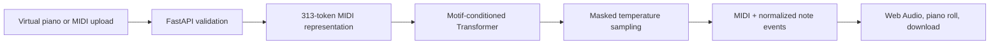

# Motif — Piano Continuation Studio

[](https://render.com/)
[](https://www.python.org/)
[](LICENSE)
[](MODEL_LICENSE.md)

Motif is a non-commercial symbolic piano generation demo. A visitor records a
phrase on the browser piano or uploads a MIDI file, chooses a continuation
length and creativity level, then receives a playable and downloadable MIDI
continuation from a causal Transformer.

The project began as the included Colab notebook and is now organized as a
repeatable training pipeline, tested Python package, FastAPI service, and
responsive browser instrument.


## What it does

- Records a motif with mouse, touch, or computer keyboard input and immediate
  Web Audio feedback.
- Accepts `.mid` and `.midi` motifs up to 1 MB.
- Generates 5, 10, or 20 seconds with an adjustable temperature from 0.6 to
  1.4.
- Plays the result in the browser, draws a piano roll, and downloads MIDI.
- Keeps user inputs temporary; there are no accounts, database, analytics, or
  persistent uploads.
- Serializes inference with a short queue so a free CPU instance is not
  overloaded.

## Architecture



The tokenizer represents note-on, note-off, quantized velocity, and 10 ms time
shift events across the 88-key piano range. Training uses
`[BOS] + motif + [PAD] + [SEP] + continuation`; padding is masked and loss is
calculated only on continuation targets. This corrects the duplicated-motif
objective in the original notebook. The baseline is trained with the same
`BOS` context for a fair comparison but is not deployed.

## Run locally

Use Python 3.11 or 3.12.

```bash
python -m venv .venv
source .venv/bin/activate            # Windows: .venv\Scripts\activate
python -m pip install -r requirements-dev.txt
```

Place a trained conditioned checkpoint at
`artifacts/conditioned-best.pt`, then run:

```bash
uvicorn web.app:app --reload
```

Open `http://127.0.0.1:8000`. Without a checkpoint, the interface and health
endpoint still run, while generation deliberately returns `503` instead of
using random weights.

## Train from scratch

Training downloads the MAESTRO v3 MIDI-only archive, reads the dataset's
official train/validation/test labels, and selects the checkpoint with the
lowest validation loss.

```bash
python -m training.train \
  --data-dir data \
  --output-dir artifacts \
  --models both \
  --epochs 50 \
  --batch-size 16 \
  --seed 42
```

For a quick pipeline check, add `--limit-per-split 10 --epochs 2`. For the real
checkpoint, run the full command in a Colab GPU runtime. The training command
produces:

```text
artifacts/
├── baseline-best.pt
├── conditioned-best.pt
├── metrics.json
└── examples/
    ├── example-1.mid
    ├── example-2.mid
    └── example-3.mid
```

Do not commit the dataset or checkpoints. The original notebook's recorded
training losses (`3.9509` baseline and `3.9410` conditioned) are historical
only; replace them in your project report with the new validation and held-out
test results from `metrics.json`.

## API

### `GET /health`

Returns service status, version, and whether the checkpoint loaded. A missing
model reports `degraded` with HTTP 200 so the container remains diagnosable.

### `POST /api/generate`

Send `multipart/form-data` with:

| Field | Type | Rules |
| --- | --- | --- |
| `motif_json` | JSON string | 2–500 recorded notes; mutually exclusive with `midi_file` |
| `midi_file` | file | `.mid` or `.midi`, maximum 1 MB |
| `duration_seconds` | integer | `5`, `10`, or `20` |
| `temperature` | number | `0.6`–`1.4` |

The response contains base64-encoded MIDI, normalized note events, motif and
continuation timing, and whether sampling reached the requested duration.
Invalid inputs return `422`, missing model configuration returns `503`, and a
full inference slot returns `429`.

## Publish the checkpoint

After training, create a public GitHub Release rather than committing weights
to Git history:

```bash
sha256sum artifacts/conditioned-best.pt
gh release create model-v1 \
  artifacts/conditioned-best.pt \
  MODEL_LICENSE.md \
  --title "Motif conditioned model v1" \
  --notes "Non-commercial checkpoint trained on MAESTRO v3.0.0."
```

Copy the asset URL and SHA-256 value. The server downloads the pinned model at
startup only when `MODEL_PATH` does not exist, then verifies it when
`MODEL_SHA256` is configured.

## Deploy on Render

1. Push this repository to a public GitHub repository.
2. In Render, choose **New > Blueprint** and select the repository. Render will
   read [`render.yaml`](render.yaml) and build the included Dockerfile.
3. Set `MODEL_URL` to the exact `model-v1` release asset URL and
   `MODEL_SHA256` to the checksum. Set `GITHUB_REPOSITORY_URL` to the public
   repository URL, set `PUBLIC_BASE_URL` to the Render service origin, and keep
   `MODEL_PATH` unchanged.
4. Deploy and confirm `/health` returns `"model_ready": true`.
5. Add the Render URL to the GitHub repository description.

Render's free service sleeps after inactivity, so the interface explains that
the first request may need time to wake. CPU inference is intentionally capped
and queued; public training is not supported.

## Repository layout

```text
src/motifgen/       Tokenizer, model, configuration, and inference
training/           MAESTRO download, split dataset, training, evaluation
web/                FastAPI service and browser piano UI
scripts/            Checkpoint download and integrity verification
tests/              Tokenizer, prompt, model, generation, and API tests
```

## Licensing and responsible use

Source code is MIT licensed. MAESTRO v3.0.0 is provided by Google LLC under
CC BY-NC-SA 4.0; the trained checkpoint and MAESTRO-derived demo artifacts are
released for non-commercial use under the same terms. See
[`MODEL_LICENSE.md`](MODEL_LICENSE.md) for attribution and citation details.

Do not upload MIDI that you do not have permission to process. Uploaded and
recorded motifs are handled only in memory for the current request.
