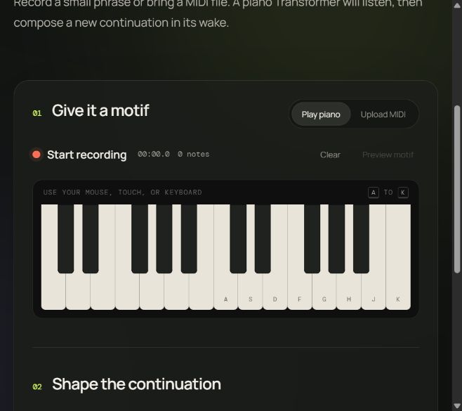

# Motif — Piano Continuation Studio

[](https://render.com/)
[](https://github.com/Tanmay-22/motif-piano-generator/actions/workflows/ci.yml)
[](https://www.python.org/)
[](LICENSE)
[](MODEL_LICENSE.md)

Motif is a non-commercial symbolic piano generation demo. A visitor records a
phrase on the browser piano or uploads a MIDI file, chooses a continuation
length, musical direction, and creativity level, then receives a playable and
downloadable MIDI continuation from a motif encoder/decoder Transformer.

The project began as the included Colab notebook and is now organized as a
repeatable training pipeline, tested Python package, FastAPI service, and
responsive browser instrument.



## What it does

- Records a motif with mouse, touch, or computer keyboard input and immediate
  piano-like Web Audio feedback, optional count-in/metronome, octave shifting,
  undo, automatic leading-silence trimming, and a live motif roll. The visible
  piano pages through two octaves at a time while the highlighted 13-key
  computer range moves left-to-right with `Z`/`X`.
- Accepts `.mid` and `.midi` motifs up to 1 MB.
- Includes melody, two-hand, and chord examples plus a motif profile that
  explains texture, register, rhythm, density, and dynamics before generation.
- Generates 5, 10, or 20 seconds with an adjustable temperature from 0.6 to
  1.4.
- With a v2 checkpoint, offers motif-led, Baroque/Classical, Romantic, and
  Impressionist/Modern directions while preserving the motif's inferred
  texture.
- Shows the active model version and elapsed generation phases instead of an
  indefinite loading state; CPU-limited partial results are labeled clearly.
- Plays the result in a seekable piano roll with an animated playhead and live
  key highlighting; supports pause/resume, restart, speed, zoom, fullscreen,
  MIDI download, and a shareable PNG piano-roll export.
- Keeps user inputs temporary; there are no accounts, database, analytics, or
  persistent uploads.
- Serializes inference with a short queue so a free CPU instance is not
  overloaded.

## Architecture


The v2 tokenizer stores onset delay, piano pitch, note duration, and velocity in
one factorized event at 10 ms resolution. A separate encoder keeps the complete
motif available through cross-attention while the causal decoder predicts only
the true contiguous continuation. Texture, density, range, timing, and dynamics
measured from the motif constrain sampling. Complete-note events make dangling
or permanently active generated notes impossible. The service can still load a
legacy v1 checkpoint, but category controls are disabled until v2 is present.

## Run locally

Use Python 3.11, 3.12, or 3.13. The Colab requirements use NumPy 2.1+
because current Colab runtimes use Python 3.13; the Python 3.11 Render image
keeps the smaller, established CPU dependency set.

```bash
python -m venv .venv
source .venv/bin/activate            # Windows: .venv\Scripts\activate
python -m pip install -r requirements-dev.txt
```

Place the trained v2 checkpoint at
`artifacts/v2/conditioned-v2-best.pt`, then run:

```bash
uvicorn web.app:app --reload
```

Open `http://127.0.0.1:8000`. Without a checkpoint, the interface and health
endpoint still run, while generation deliberately returns `503` instead of
using random weights.

## Legacy v1 comparison training

Training downloads the MAESTRO v3 MIDI-only archive, reads the dataset's
official train/validation/test labels, and selects the checkpoint with the
lowest validation loss.

```bash
python -m training.train \
  --data-dir data \
  --output-dir artifacts \
  --models both \
  --epochs 50 \
  --batch-size 16 \
  --seed 42
```

This command exists to reproduce the notebook-era baseline and conditioned v1
comparison; v1 is not the intended deployment. For a quick pipeline check, add
`--limit-per-split 10 --epochs 2`. The command
produces:

```text
artifacts/
├── baseline-best.pt
├── conditioned-best.pt
├── metrics.json
└── examples/
    ├── example-1.mid
    ├── example-2.mid
    └── example-3.mid
```

Do not commit the dataset or checkpoints. The original notebook's recorded
training losses (`3.9509` baseline and `3.9410` conditioned) are historical
only; replace them in your project report with the new validation and held-out
test results from `metrics.json`.

### Train the category-aware v2 model on free Colab

Open [`training/train_v2_colab.ipynb`](training/train_v2_colab.ipynb) in
Colab and select a GPU runtime. The notebook trains one compact 4-million
parameter encoder/decoder with Auto, Baroque/Classical, Romantic, and
Impressionist/Modern controls. It uses complete note events, persistent motif
cross-attention, balanced category sampling, mixed precision, and the official
MAESTRO splits.

Each invocation is capped at 5,000 optimizer steps. `latest.pt`, optimizer and
scheduler state, RNG state, validation history, and the best inference-only
checkpoint are stored in Google Drive. Rerunning the training cell resumes the
same run. One compressed note cache per split avoids reparsing thousands of
MIDI files after a reconnect.

The notebook deliberately installs `requirements-colab.txt` and then the
project with `--no-deps`, preserving Colab's CUDA-enabled PyTorch. The regular
`requirements.txt` remains CPU-only for local/Render inference.

The same v2 workflow can run outside Colab:

```bash
python -m training.train_v2 \
  --data-dir data \
  --cache-dir data/v2-cache \
  --output-dir artifacts/v2 \
  --resume auto \
  --max-steps 30000 \
  --session-steps 5000 \
  --batch-size 16 \
  --gradient-accumulation 4
```

Validation reports both normal loss and loss with motifs shuffled between
examples. `motif_dependency_gap = shuffled_motif_loss - loss` should become
positive; this tests whether the decoder benefits from the correct motif
instead of behaving like an unconditional baseline.

The final notebook cells evaluate the complete official validation/test splits,
compare against freshly initialized weights, export deterministic held-out
listening examples, validate the release quality gates, and assemble the
checkpoint, report, license, examples, manifest, and SHA-256 checksums.

## v2 evaluation

The deployed `conditioned-v2-best.pt` checkpoint was selected at optimizer step
5,000. Lower loss is better. These measurements use every example in the
official MAESTRO v3 validation and held-out test splits:

| Measurement | Result |
| --- | ---: |
| Validation loss | `1.816188` |
| Held-out test loss | `1.763603` |
| Untrained validation loss | `5.912978` |
| Validation improvement over untrained | `4.096790` |
| Validation shuffled-motif loss | `1.840028` |
| Validation motif-dependency gap | `+0.023840` |
| Test shuffled-motif loss | `1.787386` |
| Test motif-dependency gap | `+0.023783` |
| Validation note events | `15,973` |
| Test note events | `20,891` |

All release gates passed: the trained model beats freshly initialized weights,
and replacing each correct motif with another example's motif increases loss
on both validation and test data. The positive dependency gaps provide an
objective check that the decoder uses motif context instead of behaving as an
unconditional piano generator. This checkpoint completes one 5,000-step Colab
session; the training state remains resumable for a later, separately evaluated
model revision.

## Fixed held-out examples

After the `model-v2.0.0` release is published, these links provide the fixed
MAESTRO test motifs, their real continuations, and the model continuations used
for qualitative review:

| Direction | Motif | Real continuation | Generated continuation |
| --- | --- | --- | --- |
| Baroque/Classical | [MIDI](https://github.com/Tanmay-22/motif-piano-generator/releases/download/model-v2.0.0/example-1-baroque-classical-motif.mid) | [MIDI](https://github.com/Tanmay-22/motif-piano-generator/releases/download/model-v2.0.0/example-1-baroque-classical-reference.mid) | [MIDI](https://github.com/Tanmay-22/motif-piano-generator/releases/download/model-v2.0.0/example-1-baroque-classical-generated.mid) |
| Romantic | [MIDI](https://github.com/Tanmay-22/motif-piano-generator/releases/download/model-v2.0.0/example-2-romantic-motif.mid) | [MIDI](https://github.com/Tanmay-22/motif-piano-generator/releases/download/model-v2.0.0/example-2-romantic-reference.mid) | [MIDI](https://github.com/Tanmay-22/motif-piano-generator/releases/download/model-v2.0.0/example-2-romantic-generated.mid) |
| Impressionist/Modern | [MIDI](https://github.com/Tanmay-22/motif-piano-generator/releases/download/model-v2.0.0/example-3-impressionist-modern-motif.mid) | [MIDI](https://github.com/Tanmay-22/motif-piano-generator/releases/download/model-v2.0.0/example-3-impressionist-modern-reference.mid) | [MIDI](https://github.com/Tanmay-22/motif-piano-generator/releases/download/model-v2.0.0/example-3-impressionist-modern-generated.mid) |

## API

### `GET /health`

Returns service status, version, and whether the checkpoint loaded. A missing
model reports `degraded` with HTTP 200 so the container remains diagnosable.

### `POST /api/generate`

Send `multipart/form-data` with:

| Field | Type | Rules |
| --- | --- | --- |
| `motif_json` | JSON string | 2–500 recorded notes; mutually exclusive with `midi_file` |
| `midi_file` | file | `.mid` or `.midi`, maximum 1 MB |
| `duration_seconds` | integer | `5`, `10`, or `20` |
| `temperature` | number | `0.6`–`1.4` |
| `category` | string | `auto`, `baroque_classical`, `romantic`, or `impressionist_modern` |

The response contains base64-encoded MIDI, normalized note events, motif and
continuation timing, model version, applied category, inferred texture, timeout
state, and whether sampling reached the requested duration. A v1 checkpoint
accepts the field for API compatibility but reports `category_applied: false`;
the trained v2 checkpoint applies it through persistent cross-attention.
Invalid inputs return `422`, missing model configuration returns `503`, and a
full inference slot returns `429`.

## Publish the checkpoint

After the notebook's full evaluation and example export pass, its release cell
runs:

```bash
python -m scripts.prepare_v2_release \
  --checkpoint artifacts/v2/conditioned-v2-best.pt \
  --evaluation artifacts/v2/evaluation-v2.json \
  --examples-dir artifacts/v2/examples \
  --output-dir artifacts/v2/model-v2.0.0-release
```

Publish `conditioned-v2-best.pt`, the release ZIP, and the nine example MIDIs as
assets under the immutable `model-v2.0.0` GitHub Release. The server downloads
the pinned model during the Docker build and verifies `MODEL_SHA256`; startup
retains the same download path as a fallback. The release bundle also generates
`render-env-v2.txt`, so the pinned URL, checksum, and CPU settings can be copied
into Render without retyping them.

## Deploy on Render

Follow the exact [training and deployment runbook](DEPLOYMENT.md). In summary:

1. Push the source and wait for GitHub CI.
2. Train/evaluate/package v2 in the supplied free-Colab notebook.
3. Publish the immutable `model-v2.0.0` GitHub Release.
4. Set Render's `MODEL_URL` and `MODEL_SHA256`, then deploy the Blueprint.
5. Confirm `/health` reports API `2.0.0`, `model_ready: true`, and
   `model_version: "v2"`.
6. Run `python -m scripts.smoke_test_deployment --base-url <render-origin>` or
   the manual **Deployment smoke test** GitHub Action.

Render's free service sleeps after inactivity, so the interface explains that
the first request may need time to wake. CPU inference is intentionally capped
and queued; public training is not supported.

## Repository layout

```text
src/motifgen/       Tokenizer, model, configuration, and inference
training/           MAESTRO download, split dataset, training, evaluation
web/                FastAPI service and browser piano UI
scripts/            Checkpoint download, release gates, deployment smoke test
tests/              Tokenizer, prompt, model, generation, and API tests
```

## Licensing and responsible use

Source code is MIT licensed. MAESTRO v3.0.0 is provided by Google LLC under
CC BY-NC-SA 4.0; the trained checkpoint and MAESTRO-derived demo artifacts are
released for non-commercial use under the same terms. See
[`MODEL_LICENSE.md`](MODEL_LICENSE.md) for attribution and citation details.

Do not upload MIDI that you do not have permission to process. Uploaded and
recorded motifs are handled only in memory for the current request.
